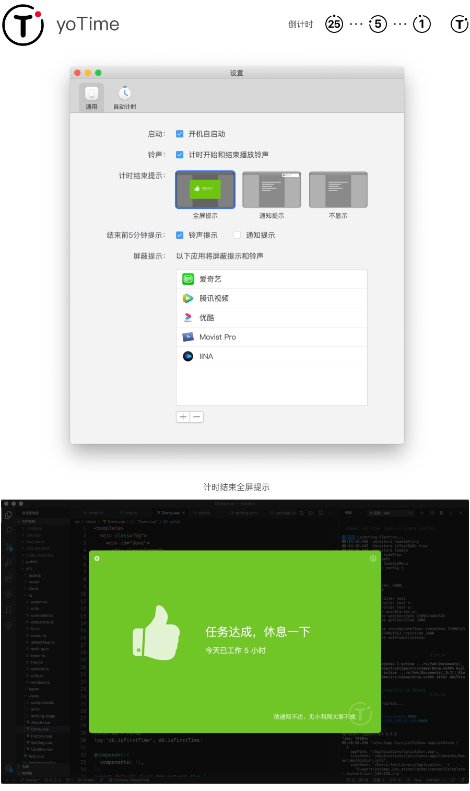

# yoTime

[中文](https://gitee.com/yoodu/yoTime)

yoTime is a simple and friendly work timer that helps to concentrate on work, rest in time, and avoid sedentary.

[Download ❯](https://github.com/yoodu/yoTime/releases/latest) (Currently only supports Mac, consider supporting windows in the future) 

[Alternate download ❯](https://gitee.com/yoodu/yoTime/releases/)

## Features

- Support global shortcut key to control: start timing (ctrl+alt+1), stop timing (ctrl+alt+2)
- Support auto start timing at specified APP
- A variety of remind for end of timing  such as full screen, notification and non-display
- Friendly ringtone reminder (can be turned off)
- Simple icon countdown shows remaining time

## How to use

1. Schedule work tasks and assign 25 minutes of work
2. Turn on timing (shortcut key)
3. Focus on the task until the end of time
4. Rest for 5 minutes
5. Take a 15-minute break after 4 consecutive sessions

## About the Pomodoro Technique

yoTime can be used in the Pomodoro Technique. The Pomodoro Technique is a time management method. The timer is used to divide the time into a 25-minute working time and a 5-minute rest time. During the work, focus on the work and do not allow you to do anything irrelevant to the task. Things that help:

-Concentrate and reduce interruptions
-Promote task division, enhance decision-making awareness, and improve task enforceability
-Awaken and lasting incentives, consolidate the determination to achieve goals and reduce time anxiety

## Easter egg

yoTime stems from the need for time and energy management in your daily work. With the increase of age and long hours of overtime work (1 and 2 hours per sitting), the body is in poor condition every day. Strongly prompted products, I hope you like it, welcome to feedback questions and comments in issue.

In the future, we plan to add data recording function to better record working time.

... More features, stay tuned!

